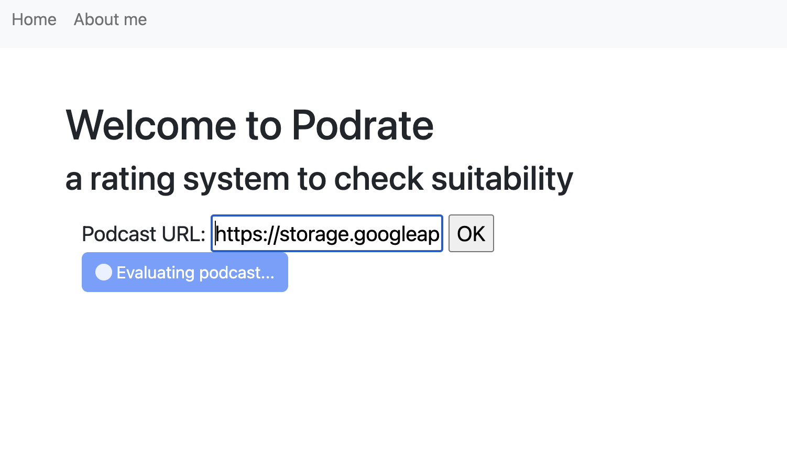
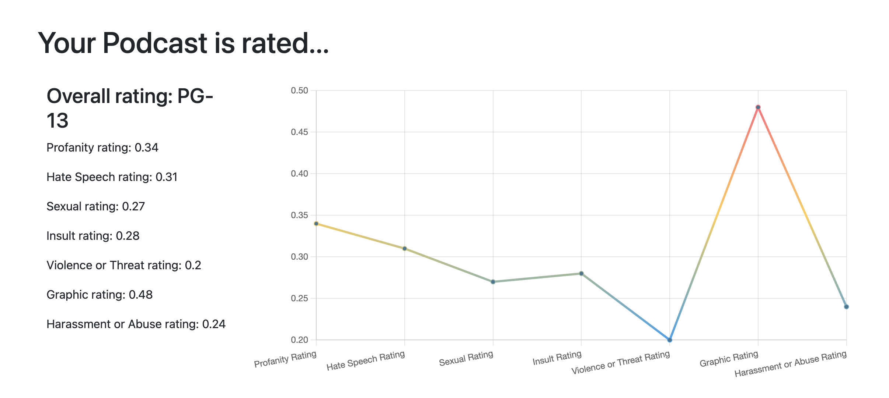

# Podrate
An app that rates the toxicity level of the audio file that you input. The goal is to be able to rate podcasts and have a understanding of the content prior to listening.

This **[Django/Python](https://www.djangoproject.com/)** app leverages **AWS's [Transcribe](https://aws.amazon.com/pm/transcribe/?gclid=Cj0KCQjwsJO4BhDoARIsADDv4vBGihOt4VMjLht0OuXS6yvCbKvUY9d9Mr91Z3xD-Zwe30f3-90FgvkaAnOdEALw_wcB&trk=8217174a-004c-4464-9374-7f64e3ed195f&sc_channel=ps&ef_id=Cj0KCQjwsJO4BhDoARIsADDv4vBGihOt4VMjLht0OuXS6yvCbKvUY9d9Mr91Z3xD-Zwe30f3-90FgvkaAnOdEALw_wcB:G:s&s_kwcid=AL!4422!3!652240143553!e!!g!!amazon%20transcription!19878157838!144181888781) and [S3](https://aws.amazon.com/s3/)** services and displays the information using **[Chart.js](https://www.chartjs.org/docs/latest/)** to display the data.

